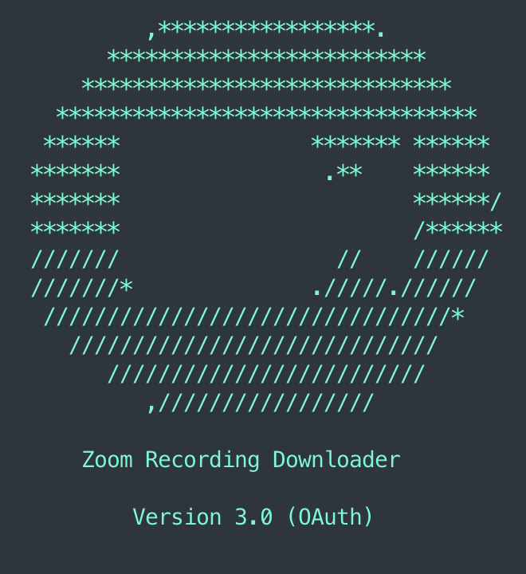

# zoom-recording-downloader

[](https://www.python.org/) [](https://raw.githubusercontent.com/ricardorodrigues-ca/zoom-recording-downloader/master/LICENSE)

**Zoom Recording Downloader** is a cross-platform Python script that uses Zoom's API (v2) to download and organize all 
cloud recordings from all users in a Zoom account to local storage.


## Screenshot ##



[TOC]

## Installation ##

_Attention: You will need [Python 3.6](https://www.python.org/downloads/) or greater_

```sh
$ git clone https://github.com/ricardorodrigues-ca/zoom-recording-downloader
$ cd zoom-recording-downloader
$ pip3 install -r requirements.txt
```

## Usage Overview ##

_Attention: You will need a [Zoom Developer account](https://marketplace.zoom.us/) in order to create a [Server-to-Server OAuth app](https://developers.zoom.us/docs/internal-apps) with the required credentials_

1. Create a [server-to-server OAuth app](https://marketplace.zoom.us/user/build), set up your app and collect your credentials (`Account ID`, `Client ID`, `Client Secret`). For questions on this, [reference the docs](https://developers.zoom.us/docs/internal-apps/create/) on creating a server-to-server app. Make sure you activate the app. Follow Zoom's [set up documentation](https://marketplace.zoom.us/docs/guides/build/server-to-server-oauth-app/) or [this video](https://www.youtube.com/watch?v=OkBE7CHVzho) for a more complete walk through.

1. Add the necessary scopes in your app's _Scopes_ tab:
   * View users
     * `user:read:list_users:admin`
   * Lists all cloud recordings for a user
     * `cloud_recording:read:list_user_recordings:admin`

1. Copy **zoom-recording-downloader.conf.template** to a new file named **zoom-recording-downloader.conf** and set up 
   your configuration (see **Configuration** section below for details). 

1. Run the script:

   ```sh
   $ python3 zoom-recording-downloader.py
   ```

## Configuration
Once you have copied the template conf file you can configure how you would like the script to behave.

Most of the settings have sensible defaults. 

The only one that you have to specify is the first one...

### Server-to-Server OAuth app credentials:
```json
{
  "OAuth": {
    "account_id": "<ACCOUNT_ID>",
    "client_id": "<CLIENT_ID>",
    "client_secret": "<CLIENT_SECRET>"
  }
}
```
The rest of the settings are optional but give you a lot of control over how the script behaves.

### Base directory for downloads
* Specify **download_dir** - the base directory where the meeting files (video, audio, transcript etc.) will be downloaded. 
* Default is: `downloads`
```json
{
  "Storage": {
    "download_dir": "downloads"
  }
}
```

### Time Window
* Specify the **start_date** from which to start downloading meetings (default is Jan 1 this year)
* Specify the **end_date** at which to stop downloading meetings (default is today)
* Dates are specified as `YYYY-MM-DD`
```json
{
  "Recordings": {
    "start_date": "2023-01-01",
    "end_date": "2023-12-31"
  }
}
```
If you don't specify the **start_date** you can specify the year, month, and day separately
* Specify the day of the month to start as **start_day** (default is 1)
* Specify the month to start as **start_month** (default is 1)
* Specify the year to start as **start_year** (default is this year)
```json
{
  "Recordings": {
    "start_year": "2023",
    "start_month": "1",
    "start_day": "1"
  }
}
```

### Behaviour
Specify which **mode** to run in. 
* **size** is useful for checking if you have enough disk space for all the files in scope for download. 
* Default is **download**. 
```json
{
  "Behaviour": {
    "mode": "download|size"
  }
}
```

### Filtering users and meetings, and naming downloaded files  
* You may need to download meeting files from a large organisation. 
* You may not want to download meetings for all the users in this organisation. 
* You may not want to download all the meetings for each user. 
* You may want more control over how meeting files are named, perhaps by cross-referencing with metadata from elsewhere 
(i.e. data not available in Zoom).

These considerations are handled using a class that implements the `MeetingHelperStrategy` interface.
* Default is `DefaultMeetingHelperStrategy`
```json
{
  "Strategy": {
    "module": "lib.strategies",
    "class": "DefaultMeetingHelperStrategy",
    "config": {}
  }
}
```
The default **Strategy** has its own **config** section which is also *optional*. (Sensible defaults are provided.)

There are 3 sections to the **config** section for the `DefaultMeetingHelperStrategy`:

1. **Include**: Which users (**emails**) and meetings (**topics**) would you explicitly like to _include_ in the download?
   * Default is: **include all** users and meetings for the time window.
   * If you specify **emails** or **topics** then only these users and meetings will be _included_ in the download
1. **Exclude**: Which users (**emails**) and meetings (**topics**) would you explicitly like to _exclude_ from the download?
   * Default is **exclude none**
   * If you specify **emails** or **topics** then these users and meetings will be _excluded_ from the download
1. **FilepathFormat**: Where do you want to put the downloaded files relative to the **download_dir**, and how would 
   you like to name them?

**Note:** Values for `emails` and `topics` use a glob pattern syntax with asterisks as wildcards to make including and excluding 
users and meetings a bit easier.

Here is an example of a completed config for this part:
```json
{
    "Strategy": {
        "module": "lib.strategies",
        "class": "DefaultMeetingHelperStrategy",
        "config": {
            "Include": {
                "emails": ["*@somedomain.com", "robert@someotherdomain.co.uk"],
                "topics": ["* Monthly Meeting"]
            },
            "Exclude": {
                "emails": ["max@somedomain.com"],
                "topics": ["CEO Monthly Meeting"]
            },
            "FilepathFormat": {
                "timezone": "UTC",
                "strftime": "%Y%m%d-%H%M",
                "folder": "{year}/{month}/{meeting_time}-{topic}",
                "filename": "{meeting_time}-{topic}-{rec_type}-{recording_id}.{file_extension}",
                "filepath_replace_old": " ",
                "filepath_replace_new": "_"
            }
        }
    }
}
```

#### FilepathFormat
* Specify the **timezone** for the meeting dates and times saved in the filenames (default is 'UTC')
  * You can use any timezone supported by [ZoneInfo](https://docs.python.org/3/library/zoneinfo.html)
* Specify the time format for the saved meeting times in the filenames 
  * Default is `%Y.%m.%d - %I.%M %p UTC`
  * You can use any of the [strftime format codes](https://docs.python.org/3/library/datetime.html#strftime-and-strptime-format-codes) supported by datetime
* Specify the format for the **folder** name (under the download folder) for saved meetings 
  * Default is `{topic} - {meeting_time}`
* Specify the format for the **filename** of saved meetings
  * Default is `{meeting_time} - {topic} - {rec_type} - {recording_id}.{file_extension}`)

For the previous formats you can use the following `variables` in the values:

* `{file_extension}` is the lowercase version of the file extension
* `{meeting_time}` is the time in the format of **strftime** and **timezone**
* `{day}` is the day from `meeting_time`
* `{month}` is the month from `meeting_time`
* `{year}` is the year from `meeting_time`
* `{recording_id}` is the recording id from Zoom
* `{rec_type}` is the type of the recording
* `{topic}` is the title of the Zoom meeting

Finally: You may want to do something like replace spaces with underscores in the file names if these are based
on meeting topics (which probably have spaces in them). 
* Specify the old string to replace using **filepath_replace_old**
* Specify the string to replace the old one with using **filepath_replace_new**
